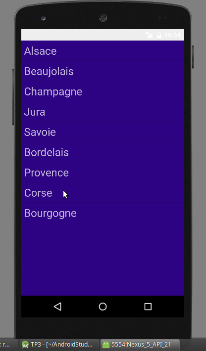
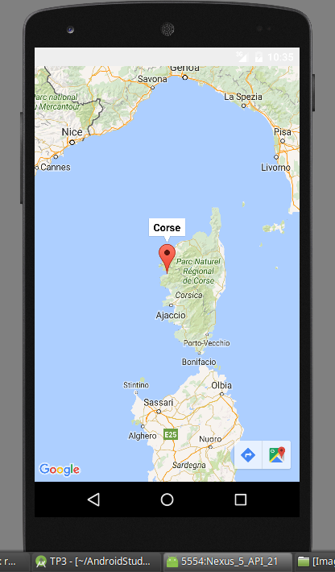
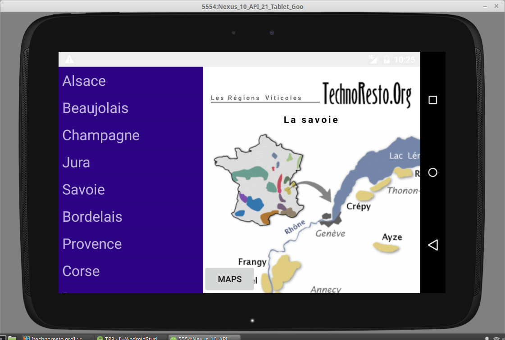
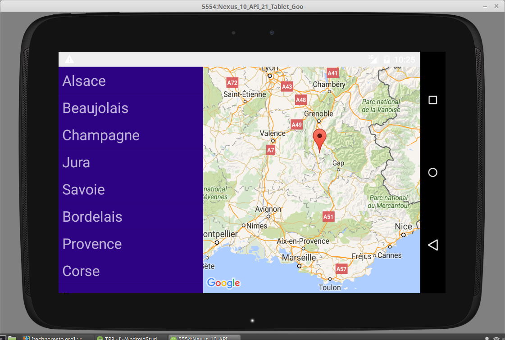

# Android TP3 #

**BERNARD Tanguy**

### Objectif ###

L’objectif de ce TP est de mettre en place une application liée à la découverte des vins français.
Techniquement l’application utilisera des fragments dynamiques pour s’adapter à différents terminaux.
L’application devre pouvoir tourner sur support Smartphone (avec un seul fragment) ou sur support
Tablette (avec 2 fragments).

### Configuration testé ###
Smartphone: 

* Nexus 5 API 21 X86  Google API's

Tablette:

* Nexus 10 API 21 X86 Google API's

### Installation ###

1. Récuperer le projet
2. Executer avec la configuration minimum requise

### Resultat ###

Sur smartphone :

  |  

Sur tablette :

 

